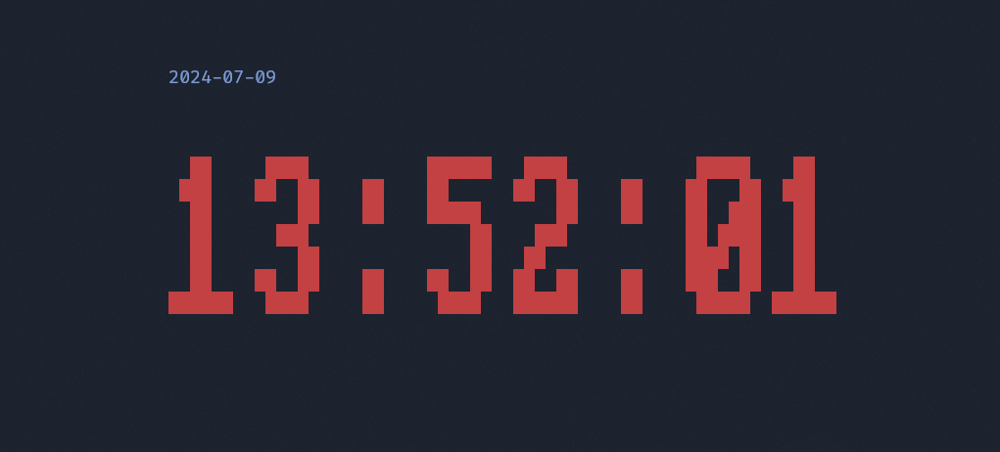

# Crock

A little clock for your terminal, written in rust.

* [Original Repository](https://git.cscherr.de/PlexSheep/crock)
* [GitHub Mirror](https://github.com/PlexSheep/crock)
* [crates.io](https://crates.io/crates/crock)
