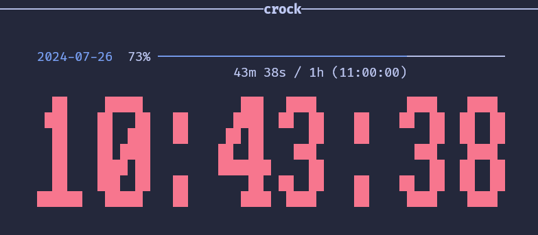

# Crock

A little clock for your terminal, written in rust.

* [GitHub](https://github.com/PlexSheep/crock)
* [crates.io](https://crates.io/crates/crock)

## Compilation

The `desktop` and `sound` features require additional system dependencies:

| Feature   | Dependency | PKG Name on Debian based Distributions |
|-----------|------------|----------------------------------------|
| `desktop` | dbus       | `libdbus-1-dev`                        |
| `sound`   | alsa       | `libasound2-dev`                       |

If you want to compile without these features, you will not have notifications 
and sound alerts for countdown mode. (Use `cargo build -r --no-default-features`)

## Acknoledgements

The included alarm sound is from [freesound.org](https://freesound.org):

-> ["effect_notify.wav" by ricemaster (CC-0)](https://freesound.org/people/ricemaster/sounds/278142/)
